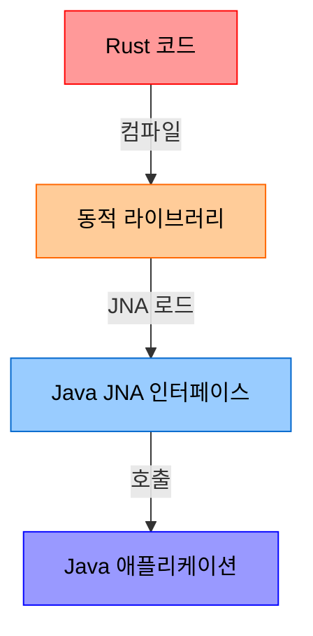
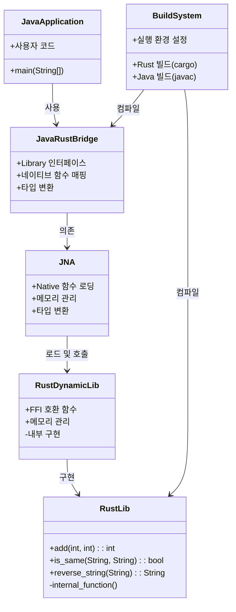
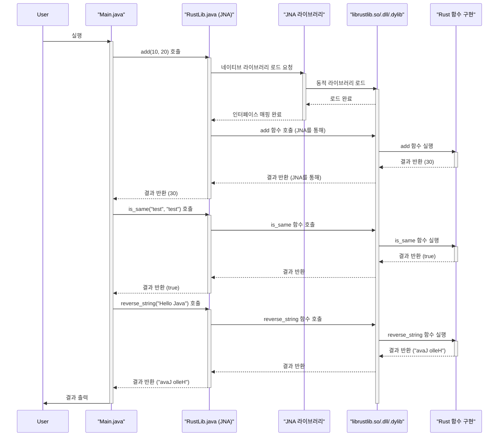
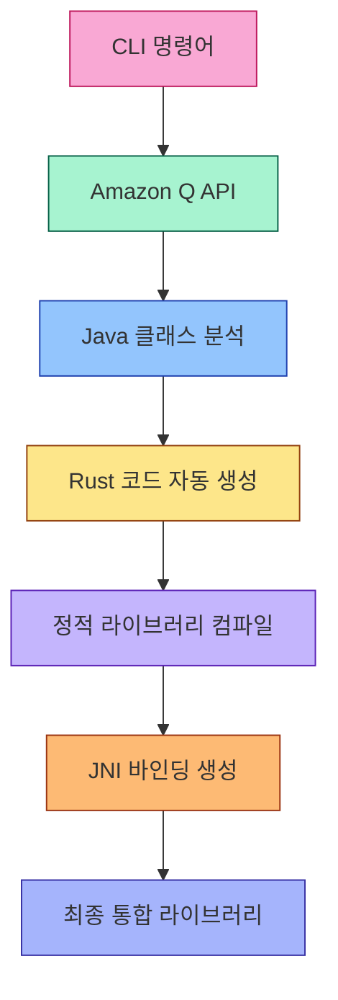
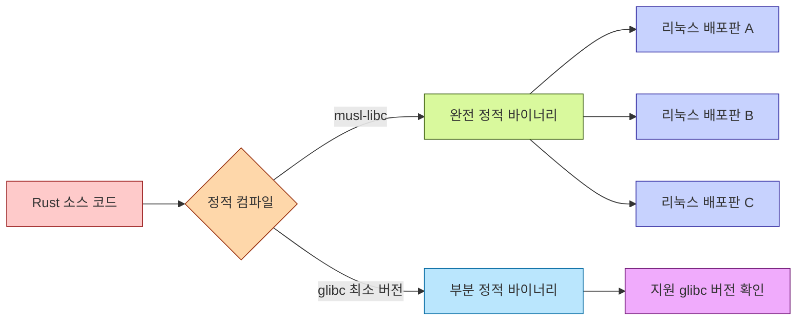

# RJBridge

Rust와 Java 간의 브릿지 연결을 제공하는 라이브러리입니다. Rust 코드를 동적 라이브러리로 컴파일한 후, Java에서 JNA(Java Native Access)를 사용하여 해당 라이브러리의 함수를 호출할 수 있게 해줍니다.

## 필수 요구사항

### Rust
[Rust 설치 페이지](https://www.rust-lang.org/tools/install)  
Rust와 Cargo가 설치되어 있어야 합니다.

### Java JDK
[Java 다운로드 페이지](https://www.oracle.com/java/technologies/javase-downloads.html)  
Java JDK가 설치되어 있어야 합니다.

### JNA (Java Native Access)
이 프로젝트는 [JNA](https://github.com/java-native-access/jna)를 사용하여 Rust 동적 라이브러리와 인터페이스합니다.

소스에서 설치:
JNA GitHub 저장소([https://github.com/java-native-access/jna](https://github.com/java-native-access/jna))에서 클론하고 빌드할 수 있습니다.  
이 예제에서는 JNA JAR 파일이 `jna-5.16.0/dist/jna.jar`에 위치해 있다고 가정합니다.

## 빌드 방법

### Rust 라이브러리 빌드
```bash
cd rustlib
cargo build --release
```

빌드가 완료되면 플랫폼별 동적 라이브러리 파일이 `rustlib/target/release/` 디렉토리에 생성됩니다.
- Linux: librustlib.so
- macOS: librustlib.dylib
- Windows: rustlib.dll

### Java 컴파일
```bash
# Linux/Mac 예시:
cd java
javac -cp .:/path/to/jna.jar RustLib.java Main.java

# Windows에서는 클래스패스 구분자로 ;를 사용합니다.
```

### 실행
```bash
# 프로젝트 루트 디렉토리에서 실행
java -Djna.library.path=./rustlib/target/release/ -cp java:jna-5.16.0/dist/jna.jar Main
```

## 실행 결과
```
Result: 30
Is Same: true
In String: Hello Java - Rust here!
```

## 아키텍처

### 기본 아키텍처



### 컴포넌트 모델



### 시퀀스 다이어그램



## 구현 세부 사항

### Rust 코드 (rustlib/src/lib.rs)
Rust 코드는 FFI(Foreign Function Interface)를 통해 Java에서 호출 가능한 함수들을 제공합니다. 이 함수들은 `extern "C"` 키워드를 사용하여 C ABI 호환성을 보장합니다.

### Java 코드 (java/RustLib.java)
JNA를 사용하여 Rust 동적 라이브러리의 함수들을 매핑하는 인터페이스를 정의합니다.

### Java 애플리케이션 (java/Main.java)
RustLib 인터페이스를 사용하여 Rust 함수를 호출하는 예제 애플리케이션입니다.

## 기여 방법
1. 이 저장소를 포크하세요
2. 새 기능 브랜치를 생성하세요 (`git checkout -b feature/amazing-feature`)
3. 변경 사항을 커밋하세요 (`git commit -m 'Add some amazing feature'`)
4. 브랜치에 푸시하세요 (`git push origin feature/amazing-feature`)
5. Pull Request를 생성하세요

## 향후 개발 계획

### CLI 도구 구현 및 Amazon Q 통합

프로젝트의 다음 단계로, CLI(Command Line Interface) 도구를 개발하여 Java-Rust 통합 프로세스를 자동화할 계획입니다. 이 구현은 다음과 같은 특징을 갖게 됩니다:



#### 주요 기능:

1. **Java 클래스 자동 분석**
   - Amazon Q AI 기능을 활용하여 주어진 Java 클래스들의 메서드, 필드, 구조를 자동으로 분석
   - 클래스 간 의존성 그래프 생성 및 JNI 인터페이스 최적화 지점 식별

2. **정적 Rust 라이브러리 생성**
   - 동적 라이브러리 의존성 제거
   - 플랫폼별 배포 복잡성 감소
   - 컴파일 타임 안전성 검증 향상
   - 모든 리눅스 배포판에서 원활한 동작을 위한 정적 컴파일(static compilation) 구현
   - glibc 버전 의존성 제거로 배포 호환성 강화

3. **JNI(Java Native Interface) 기반 통합**
   - JNA 대신 JNI를 사용하여 성능 향상
   - 타입 안전성 강화
   - 네이티브 메모리 관리 최적화

#### 리눅스 호환성 및 정적 컴파일

프로젝트의 핵심 목표 중 하나는 다양한 리눅스 배포판에서의 완벽한 호환성 보장입니다. 이를 위해 다음과 같은 접근 방식을 채택합니다:



- **musl-libc 기반 정적 컴파일**: 모든 의존성을 포함한 완전 정적 컴파일로 glibc 의존성을 완전히 제거합니다.
- **크로스 컴파일 지원**: 다양한 CPU 아키텍처(x86_64, ARM, AArch64 등)에 대한 정적 바이너리 생성을 자동화합니다.
- **컨테이너 기반 빌드 환경**: 플랫폼 독립적인 빌드 환경을 위한 Docker 컨테이너 제공.
- **최소 시스템 요구사항**: 모든 리눅스 배포판에서 추가 패키지 설치 없이 즉시 실행 가능한 바이너리 생성.

다음과 같은 정적 빌드 옵션을 CLI를 통해 제공합니다:

```bash
# 완전한 정적 컴파일 (musl 기반)
rjbridge build --static-full --target x86_64-unknown-linux-musl

# 부분 정적 컴파일 (최소 glibc 버전 지정)
rjbridge build --static-partial --min-glibc 2.17 --target x86_64-unknown-linux-gnu

# 크로스 컴파일
rjbridge build --static-full --target aarch64-unknown-linux-musl
```

이 접근 방식은 다양한 리눅스 환경에서의 배포 문제를 해결하고, "한 번 빌드하여 어디서나 실행"이라는 목표를 달성하는 데 중점을 둡니다.

## 라이센스
이 프로젝트는 MIT 라이센스 하에 배포됩니다. 자세한 내용은 `LICENSE` 파일을 참조하세요.
